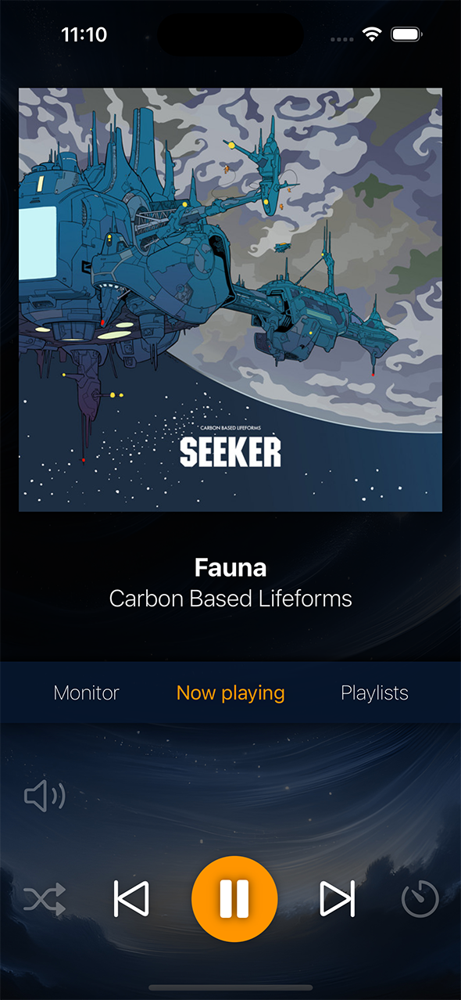
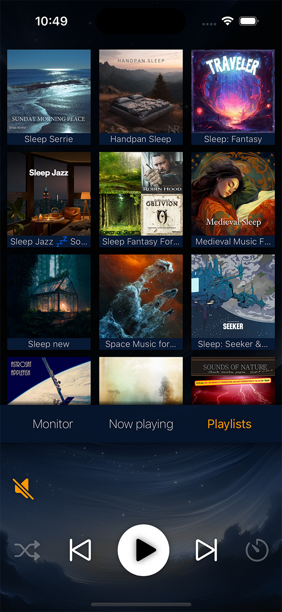

# Care Chords

Care Chords seamlessly blends an IP camera’s audio with Spotify, allowing you to enjoy music while
keeping an ear on your baby. This application is still under development and not ready for production.

## Features

- **AI-powered noise filtering** – Eliminates static and background noise from the camera’s audio
- **Full Spotify control** – Effortlessly browse and select playlists with automatic filtering
- **Smart sleep timer** – Gradually fades out music while keeping baby monitor audio active
- **Live, low-latency video** – View the camera feed in real time when the app is open
- **Background playback** – Keep monitoring even when the app is minimized
- **Auto-mute on device change** – Instantly mutes when output devices switch

## Screenshots

| Now Playing | Playlist Selector |
|------------|------------------|
|  |  |

## How does it work

The Rust backend uses GStreamer to capture audio from an IP camera via RTSP while simultaneously capturing audio from a local Spotify instance. The streams are processed, mixed, and streamed to an RTSP server for client consumption.

The client communicates with the backend over HTTP to control playback, song selection, the sleep timer, and other settings.

## To Do
 - Add configurable connection settings (currently, all addresses are hardcoded)
 - Integrate Spotify in the server and expose an RTSP stream to remove dependency on external applications
 - Implement a settings menu
